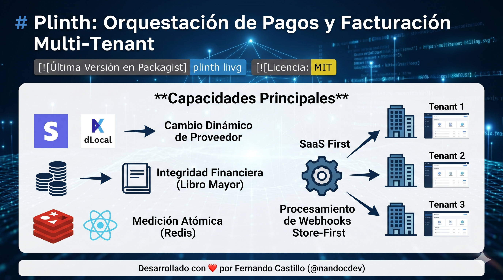

# Plinth: Multi-Tenant Billing & Payment Orchestration



[](https://packagist.org/packages/plinth/laravel-multitenant-billing)
[](https://opensource.org/licenses/MIT)

**Plinth** is a high-performance billing engine for Laravel SaaS applications. It provides a provider-agnostic abstraction layer that handles multi-tenant subscriptions, one-time payments, atomic usage metering, and financial integrity via an internal ledger.

## 🚀 Core Capabilities

- **Dynamic Provider Switching**: Support Stripe and dLocal (extendable) out of the box. Each tenant can configure their own credentials.
- **Financial Integrity (Ledger)**: Append-only ledger for all transactions, preventing data corruption and enabling easy auditing.
- **Atomic Metering (Redis)**: High-performance usage tracking with atomic counters to prevent over-consumption in distributed systems.
- **SaaS First**: Built-in support for Plans, Subscriptions, Invoices, Quotas, and Entitlements (Feature Flags).
- **Store-First Webhooks**: Robust, multi-tenant webhook handling with cryptographic verification and queued processing.

---

## 📦 Installation

```bash
composer require nandocdev/plinth-multitenant-billing
```

### 1. Register Service Provider
(Laravel auto-discovery usually handles this, but if not:)
Add `Plinth\MultiTenantBilling\BillingServiceProvider::class` to your `config/app.php`.

### 2. Configuration & Migrations
```bash
php artisan vendor:publish --tag="billing-config"
php artisan migrate
```

---

## 🛠 API Functionality

### 1. Dynamic Payment Resolution
Each tenant can have their own provider. You configure this in the `tenant_payment_providers` table.

```php
use Plinth\MultiTenantBilling\Core\Models\TenantPaymentProvider;

TenantPaymentProvider::create([
    'tenant_id' => $tenant->id,
    'provider' => 'stripe', // or 'dlocal'
    'credentials' => [
        'secret_key' => 'sk_test_...',
        'webhook_secret' => 'whsec_...',
    ],
    'status' => 'active',
]);
```

### 2. Payment Processing
Use the `PaymentProcessor` to handle direct charges (B2C context).

```php
use Plinth\MultiTenantBilling\Payments\Services\PaymentProcessor;

$processor = app(PaymentProcessor::class);

// Direct charge using tokenized payment method
$transaction = $processor->createPayin($order, [
    'payment_method' => 'pm_card_visa', 
]);

echo $transaction->status; // PAID, PENDING, FAILED...
```

### 3. Hosted Checkout (Facade)
For redirect-based flows (Checkout sessions).

```php
use Plinth\MultiTenantBilling\Facades\Billing;

$session = Billing::checkout($tenant, [
    'amount' => 5000,
    'currency' => 'USD',
    'customer_id' => $customer->id,
    'success_url' => 'https://example.com/success',
    'cancel_url' => 'https://example.com/cancel',
]);

return redirect($session['url']);
```

### 4. Usage Metering & Quotas
Manage resource consumption atomically using Redis.

```php
use Plinth\MultiTenantBilling\Billing\Quotas\QuotaEnforcer;
use Plinth\MultiTenantBilling\Billing\Exceptions\QuotaExceededException;

$enforcer = app(QuotaEnforcer::class);

try {
    // Atomic check-and-consume (e.g., track 1 unit of 'api_calls')
    $enforcer->consume($tenant->id, 'api_calls', 1);
    
    // Logic here...
} catch (QuotaExceededException $e) {
    return response()->json(['error' => 'API limit reached'], 403);
}
```

### 5. Entitlements (Feature Flags)
Check plan-based feature access with $O(1)$ complexity via Redis Sets.

```php
use Plinth\MultiTenantBilling\Billing\Entitlements\EntitlementManager;

$manager = app(EntitlementManager::class);

if ($manager->hasFeature($tenant->id, 'premium_support')) {
    // Show premium features
}
```

---

## ⚓ Webhook Integration

Plinth uses unique endpoints per tenant and provider to ensure maximum security and isolation.

### Routes Configuration
Endpoints follow this pattern: `/api/{provider}/webhooks/{tenant_id}`.

**Example Webhook Setup:**
- **Stripe**: `https://your-api.com/api/stripe/webhooks/1`
- **dLocal**: `https://your-api.com/api/dlocal/webhooks/1`

The `WebhookController` handles:
1. **Signature Verification**: Validates the payload cryptographically using the specific tenant's secret.
2. **Store-First Persistence**: Saves the raw payload in `webhook_calls`.
3. **Async Processing**: Dispatches `ProcessWebhookJob` for status normalization and ledger recording.

---

## 📊 Domain Models Reference

| Category | Models |
| :--- | :--- |
| **Billing** | `Plan`, `Subscription`, `SubscriptionItem`, `Invoice`, `InvoiceLine`, `BillingAttempt` |
| **Payments** | `Customer`, `Order`, `Transaction`, `PaymentMethod`, `Refund`, `Dispute` |
| **Core** | `LedgerEntry`, `TenantPaymentProvider`, `WebhookCall`, `UsageSnapshot` |

---

## 🧪 Testing

The package includes a full suite of Pest tests. 

```bash
vendor/bin/pest
```

For package development, Plinth utilizes `orchestra/testbench` to simulate the Laravel environment and provides a pre-configured `TestCase` with in-memory SQLite migrations.

---

## 📜 License

The MIT License (MIT). Please see [License File](LICENSE) for more information.

---
Developed with ❤️ by [Fernando Castillo (@nandocdev)](https://github.com/nandocdev)
